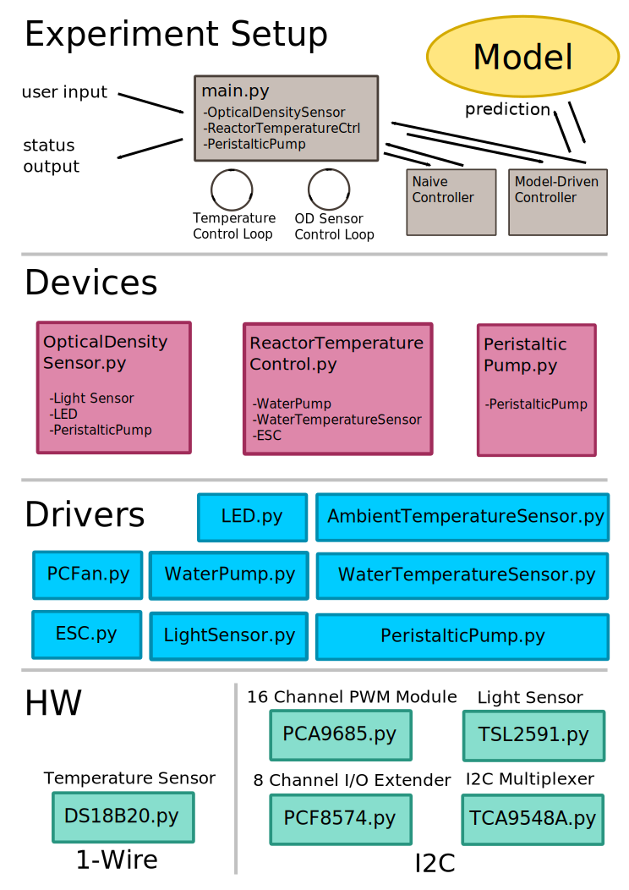
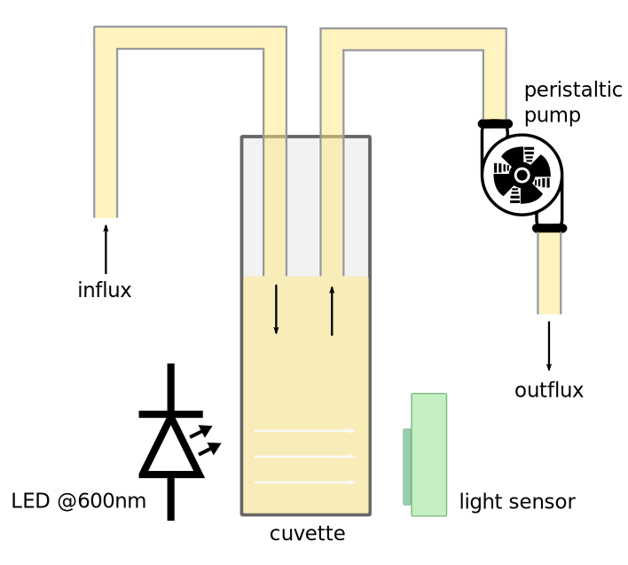
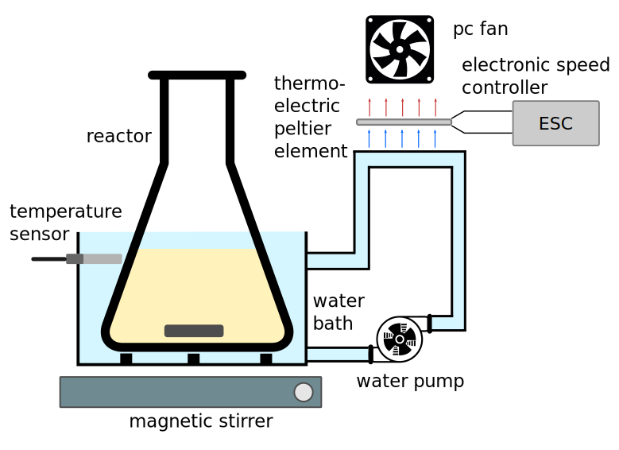

#  iGEM ETH Zurich -  Libraries for Personalized Phage Therapy

## Abstract
Antibiotic resistant pathogens are a major threat to global health. Emerging superbugs are rapidly becoming resistant to available antibiotics, while the discovery of new antibiotics is falling behind. Phage therapy offers a potential solution that has achieved remarkable successes. However, it is limited by the number of pathogens that can be targeted by available natural phages. To address this limitation, we aim to increase the range of phage specificities. Host specificity is influenced by the affinity of the phage’s binding protein to the bacterial surface. We developed a system that integrates random codons in phage genomes at any locus of interest. This allows for the formation of phage libraries with novel binding proteins that alter the host spectrum. Our bioreactor selects and evolves the best variants. The observed phage-host interactions can be used to further improve library design. Our system could be the basis for personalized treatment of bacterial infections. 
We are currently testing three approaches to generate these libraries.
* Yeast assembly: a plasmid containing the T7 genome is assembled by homologous recombination in yeast and a library of randomized oligos is inserted into variable region of tail fiber protein.
* Recombineering: A randomised sequence present on a plasmid is inserted into the tail fiber gene in vivo by using E. coli's homologous recombination machinery.
* In vitro: The tail fiber variable regions are ligated to the T7 genome in vitro by Gibson assembly. 

## Project Trailer
[](https://www.youtube.com/watch?v=lpeFW6eoZ5g?autoplay=1)

## Software Model

### General

### Phage HW Model #1: Yeast Assembly
...
### Phage HW Model #2: Recombineering
...

## Hardware Reactor
// TODO: add reactor photo

### Abstract // TODO: add final version
Experiments involving bacterial cell growth are limited by tedious manual tasks such as cell density measurements and growth medium addition. To overcome these issues, we developed a highly customizable, extendable and cost-efficient bioreactor. Independent flasks for cell growth are integrated with temperature control, continuous OD measurement using our self-built OD sensors and peristaltic pumps. 
 
Complementary software allows implementation of new experimental setups, custom control and monitoring mechanisms. Remote access and alerts permit unsupervised, long-term experiments. Collected data from ongoing experiments can be used to determine parameters such as growth rates which in turn can be used to make predictions and adjust growth conditions accordingly. 
Hardware design, software and documentation are freely available.
 
Our prototype was of great use for our long term and large volume experiments which led to multiple iterations of hardware and software improvements.This reactor is a valuable tool that significantly increases efficiency and experiment reproducibility.


### Hardware Overview


### Hardware Components

#### Computer: Raspberry Pi 3B

#### Water Temperature Sensor: DS18B20

#### Microprocessor: Arduino Nano

#### Electronic Speed Controller ESC

#### Thermoelectric Peltier Element: TEC1-12715

#### Ambient Temperature and Pressure Sensor: BME280

#### 8 Channel Input/Output Port Extender: PCF8574

#### Light Emitting Diode LED: TLCY5800

#### I2C Bus Multiplexer: TCA9548A

#### High Dynamic Range Digital Light Sensor: TSL2591

#### 16 Channel Pulse Width Modulation Module: PCA9685

#### Optocoupler: TLP281

#### PC Fan

#### Water Pump

#### Peristaltic Pump

#### Magnetic Stirrer

#### Control Terminal


### Software Overview



### Devices
...

#### Optical Density Sensor

...

#### Reactor Temperature Control


...

#### Peristaltic Pump
...


### Drivers
...

### HW
...

#### 1 Wire
...
##### DS18B20

#### I2C
...
##### PCA9685
...

##### PCF8574
...

##### TCA9548A
...

##### TSL2591
....


## Hardware Software Interaction
...

### Motivation


### Naive Constant Cell Density Controller

### Advanced Naive Constant Cell Density Controller

### Model Driven Constant Cell Density Controller

### Model Driven Constant Cell Denisty Controller with Fluorescent Original Host


## Usage
```
connect to the device:
1. plug in the power cable and switch on the power supply (the system starts up autoatically)
2. connect to the wifi network 'igem-ethz' (you should get an ip address from the DHCP server in the range 192.168.4.2-100)
3. connect to the server at address 192.168.4.1: (i.e. ssh pi@192.168.4.1)
 - username: pi
 - password: PASSWORD
4. change directory to igem19-ethz-phage-hw-model (i.e. cd igem19-ethz-phage-hw-model)
5. start the reactor software using the command: ./startup.sh
6. after the automatic device initialization, you should see all available commands printed to stdout
```

```
fetch the whole repo:
git clone https://github.com/andreaskuster/igem19-ethz-phage-hw-model.git
```

```
update local repo to the most recent version:
git pull
```

```
keep the experiment running while disconnecting the computer:
- at startup, run: screen
- detach from session: Ctrl + a d
- attach to session: screen -r
```
```
connect to the graphical user interface:
1. connect to the wifi
2. use vnc viewer (realvnc)
 -address: 192.168.4.1
 -username: pi
```

## Raspberry Pi Setup
...

## 3D Print CAD Design

### Optical Density Sensor

### Water Bath