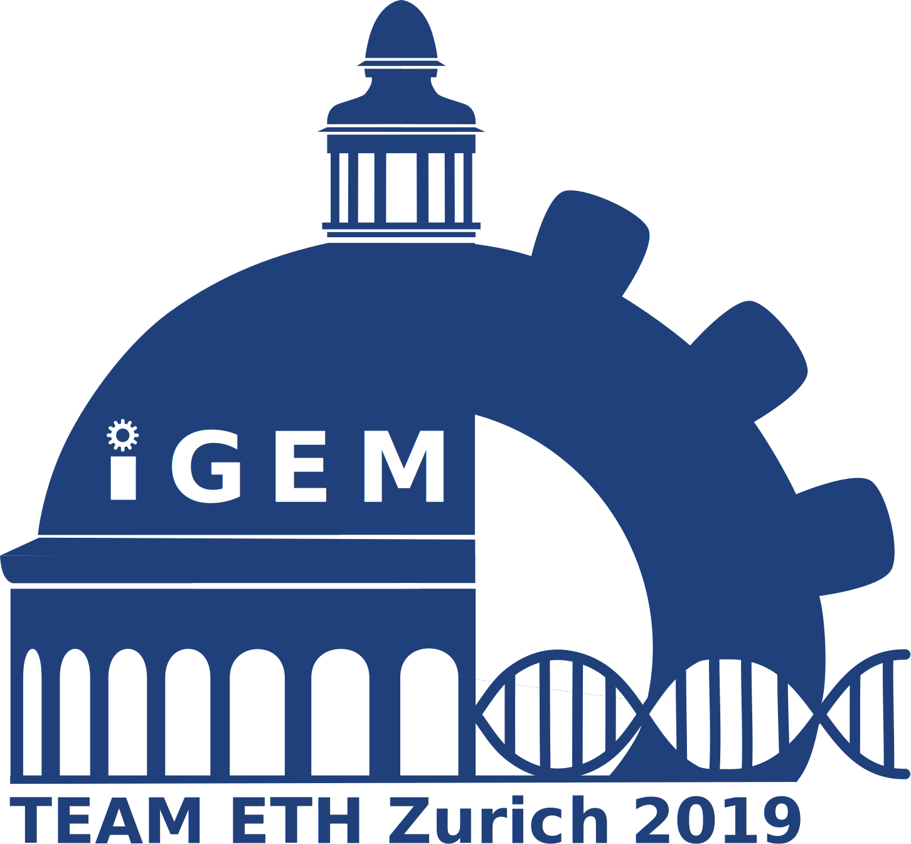

#  iGEM ETH Zurich -  Libraries for Personalized Phage Therapy

## Project Description
Antibiotic resistance is one of the biggest threats to global health, food security and development of our society today. Without effective antibiotics, treatment of common infections and minor injuries becomes significantly harder, leading to the necessity of new therapeutic strategies. Phage therapy is an alternative method to treat bacterial infections. However, screening and engineering of phages specific to new targets remains a challenge. In our project, we aim to develop a system that allows for the efficient generation of phage libraries containing tail fiber proteins with novel binding abilities using a three-step approach based on T7 bacteriophage. First, non-conserved regions of the tail fiber protein are randomized. Then, the mutated genome sequences are packaged into phages with the original tail fiber protein in vitro. Lastly, the original host is infected with these hybrid phages, leading to the production of phages with altered tail fibers.

We are currently testing three approaches to generate these libraries.
* Yeast assembly: a plasmid containing the T7 genome is assembled by homologous recombination in yeast and a library of randomized oligos is inserted into variable region of tail fiber protein.
* Recombineering: A randomised sequence present on a plasmid is inserted into the tail fiber gene in vivo by using E. coli's homologous recombination machinery.
* In vitro: The tail fiber variable regions are ligated to the T7 genome in vitro by Gibson assembly. 

# Phage HW Model #1: Yeast Assembly
...
# Phage HW Model #2: Recombineering
...

